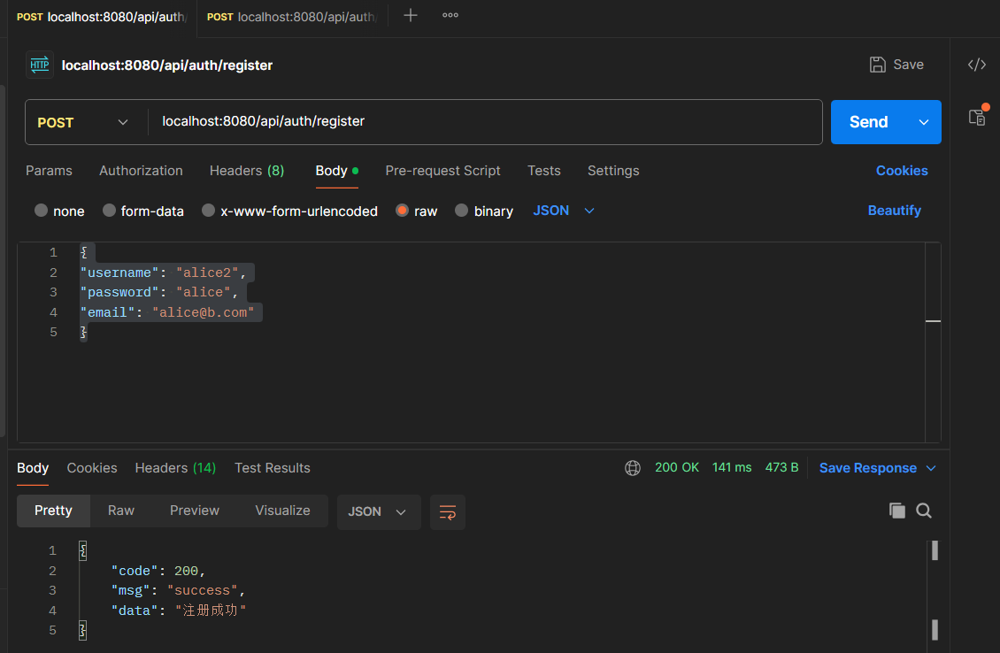
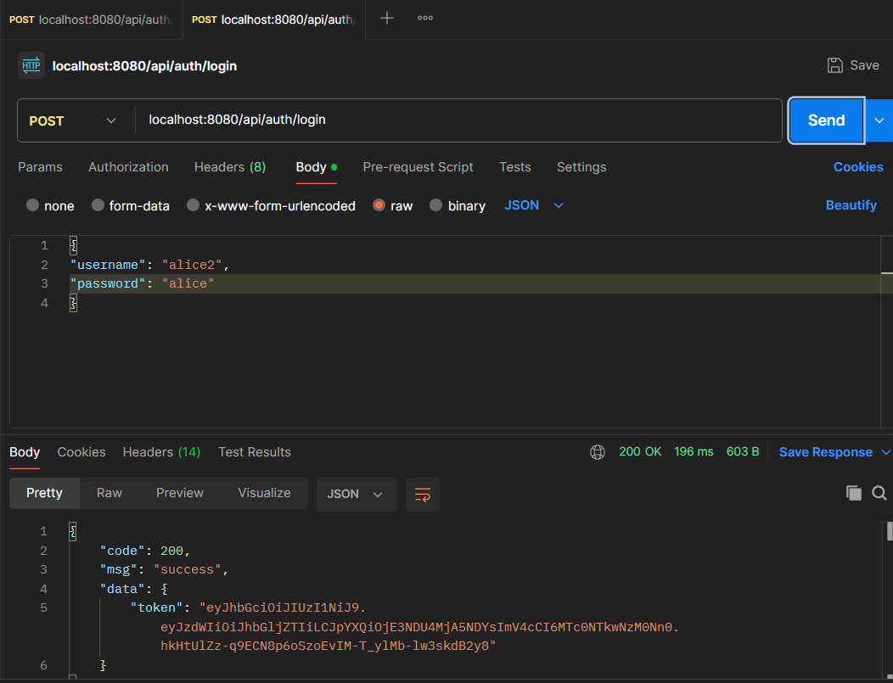

# 后端数据库操作方法

## 配置数据库的用户名、密码

为保证各个组员的数据库账密在`application.properties`中不互相冲突，采用`.env`文件配置，可以根据`.env.example`改写成自己的`.env`。这个文件不会随着git而更新，只需要更改这个文件中自己的账密，即可正确打开数据库。

```bash
DB_URL=jdbc:mysql://localhost:3306/<Your_Database>?useSSL=false&serverTimezone=UTC&characterEncoding=utf8
DB_USERNAME=<Your_Username>
DB_PASSWORD=<Your_Password>
```

## 用户

### 建表
运行`mvn install`；

cd到根目录，登录 mysql 数据库；

然后：
```sql
use webapp; -- 替换成你的数据库名
# 进入根目录
source db.sql -- 运行建表语句，无需分号；如果报错 error 2，是文件路径错误
select * from sys_user; -- 验证，应该是空的
```

注册：

```JSON
{
"username": "alice2",
"password": "alice",
"email": "alice@b.com"
}
```



登录：

```JSON
{
"username": "alice2",
"password": "alice"
}
```



## 模式API

模式分为自由模式、学习模式、挑战模式。

*******************************
警告：以下为示例，并非最后实现的内容
*******************************

```bash
1. 获取自由模式
GET http://localhost:8080/api/mode/free
响应示例：
{
    "code": 200,
    "msg": "success",
    "data": "进入自由模式"
}

2. 获取学习模式
GET http://localhost:8080/api/mode/learn
响应示例：
{
    "code": 200,
    "msg": "success",
    "data": "进入学习模式"
}

3. 获取挑战模式
GET http://localhost:8080/api/mode/challenge
响应示例：
{
    "code": 200,
    "msg": "success",
    "data": "进入挑战模式"
}

4. 切换模式
POST http://localhost:8080/api/mode/switch/learn
响应示例：
{
    "code": 200,
    "msg": "success",
    "data": "切换到learn模式"
}

5. 获取当前模式
GET http://localhost:8080/api/mode/current
响应示例：
{
    "code": 200,
    "msg": "success",
    "data": "获取当前模式"
}
```

## 关卡API

```bash
1. 获取指定模式下的所有关卡
GET http://localhost:8080/api/level/learn/all
响应示例：
{
    "code": 200,
    "msg": "success",
    "data": "获取learn模式下的所有关卡"
}

2. 获取特定关卡详情
GET http://localhost:8080/api/level/learn/1
响应示例：
{
    "code": 200,
    "msg": "success",
    "data": "获取learn模式下的第1关详情"
}

3. 获取所有关卡类型
GET http://localhost:8080/api/level/types
响应示例：
{
    "code": 200,
    "msg": "success",
    "data": "获取所有关卡类型"
}

4. 开始关卡
POST http://localhost:8080/api/level/1/start
响应示例：
{
    "code": 200,
    "msg": "success",
    "data": "开始第1关"
}

5. 完成关卡
POST http://localhost:8080/api/level/1/complete
响应示例：
{
    "code": 200,
    "msg": "success",
    "data": "完成第1关"
}
```

## 图灵机

```bash
1. 创建图灵机实例
POST http://localhost:8080/api/machine/create
请求体：
{
    "tape": "1+1=",
    "configuration": {
        "states": ["q0", "q1", "q2"],
        "initialState": "q0",
        "finalStates": ["q2"],
        "transitions": [
            // 转换规则
        ]
    }
}
响应示例：
{
    "code": 200,
    "msg": "success",
    "data": "创建新的图灵机实例"
}

2. 获取图灵机实例
GET http://localhost:8080/api/machine/list
响应示例：
{
    "code": 200,
    "msg": "success",
    "data": "获取图灵机实例"
}

3. 执行单步操作
POST http://localhost:8080/api/turing/1/step
响应示例：
{
    "code": 200,
    "msg": "success",
    "data": "执行单步操作"
}

4. 执行完整运行
POST http://localhost:8080/api/turing/1/run
响应示例：
{
    "code": 200,
    "msg": "success",
    "data": "执行完整运行"
}

5. 重置图灵机
POST http://localhost:8080/api/turing/1/reset
响应示例：
{
    "code": 200,
    "msg": "success",
    "data": "重置图灵机状态"
}
```

## 验证答案

```bash
1. 验证结果
POST http://localhost:8080/api/validation/check/1
请求体：
{
    "result": "1+1=2"
}
响应示例：
{
    "code": 200,
    "msg": "success",
    "data": "验证结果"
}

2. 获取提示
POST http://localhost:8080/api/validation/hint/1
响应示例：
{
    "code": 200,
    "msg": "success",
    "data": "获取提示"
}

3. 提交解答
POST http://localhost:8080/api/validation/submit/1
请求体：
{
    "solution": "q0,q1,q2,..."
}
响应示例：
{
    "code": 200,
    "msg": "success",
    "data": "提交解答"
}

4. 获取提交历史
GET http://localhost:8080/api/validation/history/1
响应示例：
{
    "code": 200,
    "msg": "success",
    "data": "获取提交历史"
}
```


